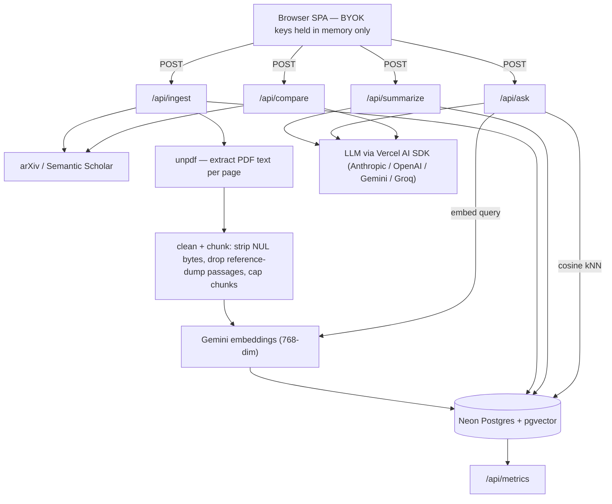

# Research Copilot

> **Recruiter TL;DR**
> - **What it is:** a full-text research-paper assistant — it ingests a paper's entire PDF, keeps a searchable library, and answers questions with section-level citations and a per-summary "does it hallucinate?" trust score. [Live demo](https://research-copilot-steel.vercel.app).
> - **Hardest problem solved:** a resilient RAG ingestion pipeline over real academic PDFs — handling NUL-byte-poisoned text that Postgres rejects, bibliography passages that poison retrieval, and free-tier embedding quotas — plus a two-pass LLM design where a summary and its faithfulness score survive independently of each other's failures.
> - **Stack:** Next.js 16 (App Router) · TypeScript · Vercel AI SDK · Neon Postgres + pgvector · Drizzle ORM · deployed on Vercel.

A focused research-paper assistant that does the things a general chatbot can't: it reads the **full text** of a paper (not just the abstract), keeps a **searchable library**, answers questions with **section-level citations**, scores each summary for **faithfulness** (a "does it hallucinate?" trust score), and lets you **ask across every paper you've saved**.

Bring your own LLM key — Anthropic, OpenAI, Gemini, or Groq — chosen in the UI and never stored.

**Live:** https://research-copilot-steel.vercel.app

---

## Why not just use ChatGPT / Claude?

| | General chat | Research Copilot |
|---|---|---|
| Reads | what you paste (often the abstract) | the **full PDF** from arXiv / open-access sources |
| Memory | forgets between chats | **persistent library** across sessions |
| Citations | "trust me" | every claim links to **§section, page** |
| Hallucination check | none | **trust score** flags unsupported claims |
| Across many papers | one at a time | **ask across your whole library** + compare |

## Features

- **Full-text ingestion** — fetches metadata from arXiv or Semantic Scholar; pulls the PDF when available, falls back to abstract-only (clearly badged).
- **Grounded summaries** — structured 7-section summary generated from the full text, cached so re-opening a paper is instant.
- **Trust score** — a second model pass verifies each summary claim against its sources and reports the fraction supported + the specific unsupported claims.
- **Cited Q&A** — retrieval-augmented answers where each statement carries a `[Cn] · paper · §section · page` citation.
- **Ask across your library** — one question, answered from every paper you've indexed.
- **Compare vs. references** — pulls a paper's top references and builds an approach/finding comparison table.
- **Metrics page** — papers indexed, summaries, average trust score, and latency by action, aggregated from a real events log.

## Architecture



**Why it's shaped this way:**

- **One database for everything.** Papers, chunks, embeddings, summaries, and the events log all live in a single **Neon Postgres** with the `pgvector` extension and an HNSW index — one bill, one migration history. A dedicated vector DB (Pinecone/Weaviate) would scale retrieval further, but at this size a single Postgres is simpler and cheaper.
- **BYOK, nothing stored.** Provider + model + key are entered in the UI, held in React state only, sent per request, and never persisted or logged. The one server secret is `DATABASE_URL`. An allowlist guard rejects unknown provider/model pairs.
- **JSON, not streaming, for the smart routes.** `/api/summarize` and `/api/ask` return JSON so a summary can carry its trust score + unsupported-claim list, and an answer can carry its citations, in one round trip — the differentiating data is only complete at the end anyway.
- **Failures are isolated.** A summary and its faithfulness score are generated by two separate model calls; the scoring pass is best-effort, so a rate-limit or hiccup on it leaves the trust score blank rather than discarding a perfectly good summary.

Full design rationale (with tradeoffs) lives in [`docs/architecture.md`](docs/architecture.md).

## Tech stack

| Area | Choice | Notes |
|---|---|---|
| Framework | **Next.js 16** (App Router) + React 19 · TypeScript | Serverless API routes + single-page UI |
| LLM access | **Vercel AI SDK v7** → Anthropic / OpenAI / Google / Groq | BYOK, provider-agnostic |
| Embeddings | **Google Gemini `gemini-embedding-001`** (768-dim) | Free tier; pinned dimension to match the vector column |
| Data | **Neon Postgres + pgvector** · **Drizzle ORM** | HNSW cosine index; SQL-first migrations |
| PDF | **unpdf** | Per-page text extraction |
| Tests | **Vitest** | Pure logic unit-tested |
| Deploy | **Vercel** (git-connected) | Push to `main` → production |

## Skills demonstrated

- **LLM application development / RAG** — full retrieval-augmented pipeline: chunking, embeddings, cosine kNN retrieval, grounded generation with citations, and an LLM-as-judge faithfulness pass.
- **Data engineering / ETL** — resilient ingestion moving raw PDFs → cleaned, chunked, embedded, queryable state, with defensive handling of malformed source data.
- **System design & architecture** — documented decision record with explicit tradeoffs and upgrade paths ([`docs/architecture.md`](docs/architecture.md)).
- **Database design & schema migrations** — pgvector schema, FK cascades, unique constraints, Drizzle-generated SQL migrations.
- **RESTful API design** — seven serverless endpoints with clear input validation and error contracts.
- **Observability** — structured request logs + an events table aggregated into a live metrics endpoint.
- **Automated testing** — unit-tested pure logic (chunking, citation extraction, verdict aggregation, input validation) with Vitest.
- **Cloud deployment** — production deployment on Vercel with git-based CD.

## Local setup

```bash
npm install
```

Create `.env.local` (the connection string is the **only** server secret):

```
DATABASE_URL=postgres://…            # Neon connection string
```

> LLM and embedding keys are **not** env vars — they're entered in the UI per session (BYOK).

Provision the database:

```bash
# In the Neon SQL editor once:  CREATE EXTENSION IF NOT EXISTS vector;
npm run db:migrate     # applies drizzle/0000_*.sql (tables + HNSW index)
```

Run it:

```bash
npm run dev            # http://localhost:3000
npm test               # unit tests
```

**Using the app:** pick an LLM provider + model and paste that provider's key; paste a **Gemini key** for embeddings (free tier); then **Add to library** with an arXiv id (e.g. `1706.03762`), a DOI (`DOI:10.1038/…`), or a Semantic Scholar id. Select a paper and hit **Summarize**; then ask questions per-paper or across the whole library.

## Testing

Unit tests (`npm test`, Vitest) cover the **deterministic** logic where correctness matters and is checkable without a model:

- chunking + section tagging, and the reference-dump exclusion filter (`lib/ingest/chunk.test.ts`)
- citation extraction — including combined `[C2, C1]` markers and stripping the papers' own reference numbers (`lib/rag/rag.test.ts`)
- faithfulness verdict aggregation (`lib/rag/faithfulness` via `rag.test.ts`)
- DB error unwrapping, provider/model allowlisting, source parsers, and env handling

The LLM-dependent behavior (summary quality, the faithfulness judgement itself) is **not** unit-tested — it's non-deterministic. There is no formal coverage percentage measured.

## Deployment

Live in production on **Vercel**, git-connected: pushing to `main` builds and deploys automatically. The only environment variable required in the Vercel project is `DATABASE_URL`; everything else is BYOK. `/api/debug` exposes read-only diagnostics (embedding column dimension, row counts, table constraints) used during development.

## Limitations & known constraints

This project runs deliberately on **free tiers**, and several behaviors follow directly from that. They're documented here honestly rather than hidden:

- **Embedding daily cap.** Gemini's free embedding tier allows ~**100 requests/min and 1,000 requests/day** (resets midnight Pacific). Each chunk is one request, so adding full-text papers consumes the daily budget quickly (~10 papers/day). Adding a payment method to the Gemini key removes the cap for fractions of a cent; embeddings are stored once and never recomputed, so reading an existing paper costs nothing — only **new adds** and **each search query** spend embedding quota.
- **Chunks are capped per paper (`MAX_CHUNKS = 90`).** This keeps a single add within the free-tier per-minute embedding budget. It covers the full text of typical papers, but the tail of very long papers is not indexed.
- **Trust score needs a non-rate-limited model call.** Faithfulness scoring is a *second* LLM call after the summary. On Gemini's free tier that second call is often rate-limited and skipped, leaving the trust score blank (the summary still shows). Using a **non-Gemini model provider** (Groq / Anthropic / OpenAI) for the LLM makes trust scores reliable. Cached summaries that were left unscored are re-scored automatically the next time they're opened.
- **BYOK keys are ephemeral.** Keys live in browser memory only and are lost on refresh — the deliberate price of storing nothing.
- **Abstract-only papers.** Many Semantic-Scholar-only papers expose no open-access PDF; those are ingested from the abstract and flagged "abstract only." The app never implies it read more than it did.
- **PDF/retrieval hygiene is heuristic.** Extracted PDF text has NUL bytes stripped (Postgres rejects `0x00`), and passages that are mostly bracketed reference numbers are treated as bibliographies and excluded from the index so they don't pollute answers. The reference-dump filter is a density heuristic, not a layout-aware parser.
- **No background queue.** Ingest and summarize run inline within the serverless function's `maxDuration`. Typical papers fit comfortably; a very large PDF could approach the limit. A queue is deferred until a real paper times out rather than built speculatively.

## Roadmap

- Streamed answers alongside the trust/citation payload
- Optional per-user auth + private libraries
- Background ingestion queue for very large PDFs
- Pluggable embedding provider (e.g. Voyage) for higher free-tier headroom
- Citation-graph exploration beyond direct references

## License

No license file is currently included — all rights reserved by default. Open an issue if you'd like to use or adapt it.

## Legacy

This started as a single Jupyter notebook that summarized paper **abstracts** (preserved in [`docs/legacy/`](docs/legacy/)). It was rebuilt into this full-text, grounded, multi-paper app.
